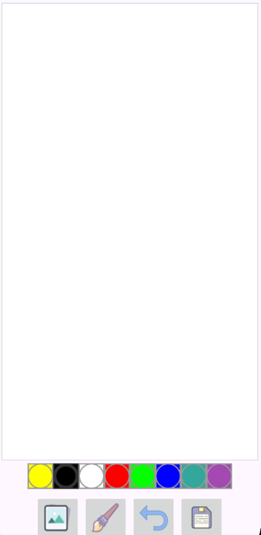
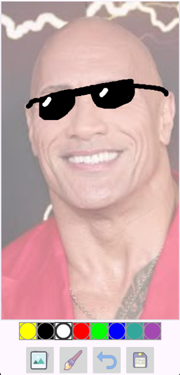

# DrawingApp

### A simple drawing application for Android that allows you to save drawings to the device gallery, as well as load images from the device memory as a background for the drawing

## Used technologies and tools

- Kotlin
- Android SDK
- Android XML

*This project was developed as part of The Complete Android 14 & Kotlin Development Masterclass by TutorialsEU*

*Minimum supported Android version is **Android 7 (Nougat)** but recommended is **Android 13 (Tiramisu)***

## Illustrations

### Drawing screen

### Drawing screen with uploaded background and ready drawing

